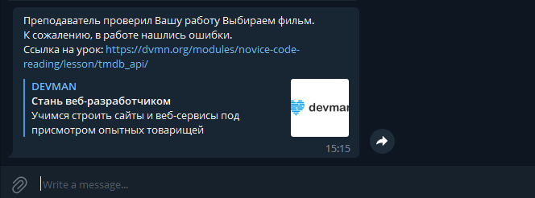

# dvmn бот для уведомлений

Скрипт шлет уведомления о результатах проверки работ с сайта [Devman](https://dvmn.org/)

## Как запустить

### Настройка параметров бота

Создайте файл `.env` со следующими переменными:
* DEVMAN_APIKEY=[Devman](https://dvmn.org/api/docs/) API token
* TELEGRAM_TOKEN=telegram bot token
* TELEGRAM_CHAT_ID=your telegram chat id

Для получения TELEGRAM_TOKEN создайте своего бота: [Bot Father](https://telegram.me/BotFather)

Для получения TELEGRAM_CHAT_ID воспользуйтесь ботом: [userinfobot](https://t.me/userinfobot)


## Как установить

### Установка библиотек и зависимостей

Развернуть виртуальное окружение интерпретатора
```sh
python3 -m venv  
```

Активируйте виртуальное окружение

```sh
source pythonenv/bin/activate 
```

Безопасно обновите pip

```sh
pip install --upgrade pip      
```

Установить требуемые библиотеки для скрипта командой
```sh
pip install -r requirements.txt
```

Для запуска выполните команду в консоли:

```commandline
python bot.py
```

### Docker

Для использования Docker контейнера, необходимо установить [Docker](https://www.docker.com/)

Для создания образа контейнера выполните команду в консоли

```commandline
docker build -t dvmn_review_bot         # create image from directory with code
```

Создайте файл `.env` со следующими переменными:
* DEVMAN_APIKEY=[Devman](https://dvmn.org/api/docs/) API token
* TELEGRAM_TOKEN=telegram bot token
* TELEGRAM_CHAT_ID=your telegram chat id

Для запуска контейнера на локальной машине выполните команду:

```commandline
docker run -d -p 80:80 --env-file [path_to_.env] [image_name]
```


## Результат выполнения

После проверки вашей работы, Вам придет уведомление:


